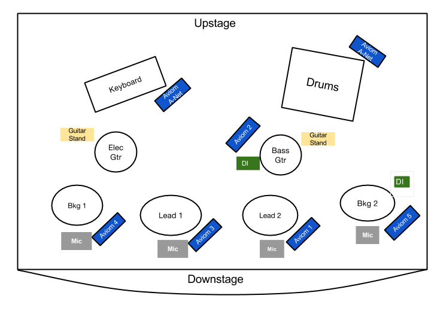

+++
date = "2016-08-30"
title = "Input Lists and Stage Diagrams"
+++

The most important communication that happens ahead of a musical event is in the form of a technical rider.

The technical rider includes specifications for sound, lighting, video, and backline equipment. The key parts of the rider are the input list, which describes all of the audio inputs the band will need, and the stage diagram, which shows the layout of the instruments and performers on stage.

An input list must contain three pieces of information for each input:
1. channel number
2. instrument name
3. microphone/direct box type

If microphone or direct box type is unknown, leave it blank. This is an example input list:

| Channel | Instrument | Input |
| ------- | ---------- | ----- |
| 1       | Lead Vocal | SM 58 |
| 2       | Bkg Vocal  | SM 58 |
| 3       | Electric Guitar  | e609 (isolation) |
| 4       | Keyboard Left  | DI |
| 5       | Keyboard Right | DI |
| 6       | Bass Amp | BETA 52a |
| 7       | Kick  | Audix D6 |
| 8       | Snare  | SM 57 |
| 9       | Drum Side  | KSM 32 |
| 10      | Drum Top  | KSM 32 |
| 11      | Click | DI |
| 12      | Tracks Left  | DI |
| 13      | Tracks Right | DI |

A stage diagram must at least contain the placement of all musicians and instruments. It can be made more helpful by adding placement of microphones, direct boxes, and guitar stands; but most of that information can be extrapolated from the arrangement of the band.

Create a more complex stage diagram for situations where the tech should not have any creative input. Create a barebones stage diagram for situations where the tech is experienced and should provide creative input.

This is a complex example of a stage diagram:

{{}}

The above example includes detailed placement information for everything including Aviom personal mixers. This type of stage diagram is useful when the band works closely with the technical team; it can help turn setup into a simple mechanical process by getting all of the decision-making out of the way in advance.

This is a simpler example of a stage diagram:

{{}}

When creating a stage diagram, it is helpful to keep the following guidelines in mind:
- arrange vocalists in order from left to right
- maintain a line of sight between drums, bass, and other rhythm instruments
- spread the band out across all available stage space
