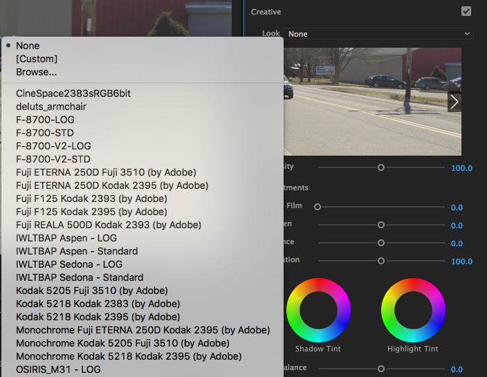

+++
date = "2017-03-02"
title = "How to Install LUTs in Premiere Pro CC"
+++

The top search result for "How to install LUTs in Premiere Mac" is [this outdated article](https://mixinglight.com/portfolio/adding-technical-creative-luts-to-the-lumetri-color-panel/).

As it stands now with Premiere Pro CC 2017, the process to install LUTs on a Mac is much simpler than the above article says it is. Instead of having to "wash" LUTs with SpeedGrade, you can put `.cube` files directly into the application directory and have them show up in the "Looks" dropdown of the "Creative" section of the Lumetri Color effect.

1. Download some LUTs. [Here is a PremiumBeat article with some options](https://www.premiumbeat.com/blog/29-free-luts-for-video/). I went for the [DeLUTS Free LUT](http://deluts.businesscatalyst.com/deluts-free-lut.html).

2. Download, unzip, and find the `.cube` file or files. Copy the file or files to your clipboard.

3. Open Finder and go to `/Applications/Adobe Premiere Pro CC 2017`. In the folder you opened, right click on the application "Adobe Premiere Pro CC 2017" and select "Show Package Contents." Then navigate to `Contents/Lumetri/LUTs`.

    In this folder, you will see three folders:
    - **Creative**, which contains the LUTs that appear in the "Looks" dropdown
    - **Legacy**, which also contains LUTs that show up in that dropdown
      
    - **Technical**, which contains the LUTs that appear in the "Input LUT" dropdown in the "Basic Correction" section of Lumetri Color
      

4. Open the `Creative` folder and paste your `.cube` file or files into it. Open or restart Premiere and the LUTs should now be permanently available in the "Looks" dropdown.

    *On a shared computer?*
    If you are not an administrator on your computer, a popup will appear asking you to enter an administrator's username and password when you attempt to paste your LUTs into the folder. This is because Premiere is installed in the systemwide applications folder by default.

    To fix this problem, copy the entire "Adobe Premiere Pro CC 2017" folder from `/Applications` to `/Users/[username]/Applications` then attempt this step again with the copy of Premiere. By copying Premiere into this folder, you have made it possible for your user to modify the application files. The only drawback is that you will now have to launch Premiere from this directory every time you use it. You can make an alias (a shortcut) to the application or keep it in your dock to make that easier.
